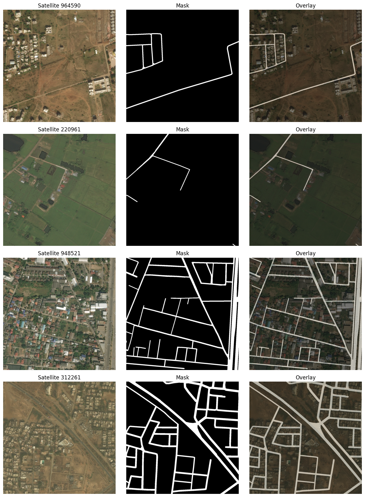

# Road Segmentation from Satellite Imagery

A semantic segmentation project for detecting roads in satellite imagery using deep learning. Compares U-Net and DeepLabV3 architectures against traditional baselines, with both local and cloud GPU training workflows.

**Key Result:** U-Net achieves **IoU 0.59** on road segmentation, significantly outperforming DeepLabV3 (IoU 0.35) and baseline methods.

---

## Results Summary

| Model | Validation IoU | Parameters | Training Time | Notes |
|-------|---------------|------------|---------------|-------|
| **U-Net (256x256)** | 0.588 | 31.0M | ~30 min (GPU) | Original resolution baseline |
| **U-Net (512x512)** | **0.565** | 31.0M | ~2 hrs (GPU) | Captures finer details; IoU slightly lower due to stricter exact-pixel matching at higher resolution |
| DeepLabV3 | 0.348 | 39.6M | ~45 min (GPU) | Pretrained ResNet-50 backbone; underperforms on thin roads |
| K-Means (k=2-6) | ~0.20-0.30 | - | <1 min (CPU) | Unsupervised clustering baseline |
| RGB Thresholding | ~0.15-0.25 | - | <1 min (CPU) | Statistical threshold baseline |

### U-Net Threshold Tuning

Optimal threshold found at **0.40-0.41**:
| Threshold | Global IoU | Mean IoU |
|-----------|------------|----------|
| 0.35 | 0.5849 | 0.5780 |
| **0.40** | **0.5882** | **0.5799** |
| 0.45 | 0.5865 | 0.5769 |

---

## Visual Results

### Sample Input/Output


### U-Net Predictions


### Training Curves


### DeepLabV3 Predictions


---

## Quick Demo (5 minutes)

```bash
# Clone and install
git clone https://github.com/willzwayn/2026-02-28-ImageClassification.git
cd 2026-02-28-ImageClassification
uv sync

# Run a baseline (no data download required for demo)
uv run python src/baselines/rgb_thresholding.py

# Run prediction with trained checkpoint
uv run python src/evaluation/predict_unet_local.py --split valid
```

> **Note:** Full training requires downloading the DeepGlobe Road Extraction dataset. See [Data Setup](#data-setup).

---

## Architecture Overview

### U-Net
Classic encoder-decoder with skip connections for preserving spatial detail.

```
Input (3x256x256)
    |-- DoubleConv(3->64)
    v
[Encoder]                    [Decoder]
    Down1: 64->128    ---->    Up4: 128->64
    Down2: 128->256   ---->    Up3: 256->128
    Down3: 256->512   ---->    Up2: 512->256
    Down4: 512->1024  ---->    Up1: 1024->512
    v
    OutConv(64->1)
    v
Output (1x256x256 logits)
```

**Key components** (`src/models/blocks.py`):
- `DoubleConv`: Conv2d -> BatchNorm2d -> ReLU (twice)
- `Down`: MaxPool2d + DoubleConv
- `Up`: ConvTranspose2d + skip concatenation + DoubleConv

### DeepLabV3
Pretrained ResNet-50 backbone with Atrous Spatial Pyramid Pooling (ASPP).

```
Input (3x256x256)
    v
ResNet-50 Backbone (pretrained on ImageNet)
    v
ASPP Module (multi-scale feature extraction)
    v
DeepLabHead (2048->1)
    v
Output (1x256x256 logits)
```

---

## Usage

### Data Setup

Download the DeepGlobe Road Extraction dataset:

```bash
# Install kaggle CLI and authenticate
pip install kaggle
kaggle datasets download balraj98/deepglobe-road-extraction-dataset

# Extract to dataset/ directory
unzip deepglobe-road-extraction-dataset.zip -d dataset/
```

Expected structure:
```
dataset/
├── train/
│   ├── <id>_sat.jpg    # Satellite images
│   └── <id>_mask.png   # Road masks
├── valid/
│   └── <id>_sat.jpg
└── test/
    └── <id>_sat.jpg
```

### Run Baselines

```bash
# Data exploration and analysis
uv run python src/baselines/data_exploration.py

# K-Means clustering baseline
uv run python src/baselines/kmeans.py

# RGB thresholding baseline
uv run python src/baselines/rgb_thresholding.py
```

### Run Training (Local)

```bash
# Train U-Net
uv run python src/training/train_unet.py

# Train DeepLabV3
uv run python src/training/train_deeplabv3.py
```

Training outputs:
- Checkpoints: `outputs/checkpoints/best_unet.pth`, `outputs/checkpoints/best_deeplabv3.pth`
- Logs: `outputs/unet/`, `outputs/deeplabv3/`
- Prediction grids saved each epoch

### Using the CLI

All training and prediction commands are available via a unified CLI:

```bash
# Train
uv run python -m src train unet
uv run python -m src train unet --epochs 10 --lr 0.001 --batch-size 4 --image-size 512
uv run python -m src train deeplabv3
uv run python -m src train deeplabv3 --epochs 5 --batch-size 16

# Predict
uv run python -m src predict unet
uv run python -m src predict unet --checkpoint outputs/checkpoints/best_unet_512.pth --split train --threshold 0.35
uv run python -m src predict deeplabv3

# Help
uv run python -m src --help
uv run python -m src train unet --help
```

### Run Prediction

```bash
# Predict with U-Net checkpoint
uv run python src/evaluation/predict_unet_local.py \
    --checkpoint outputs/checkpoints/best_unet.pth \
    --split valid \
    --threshold 0.4

# Predict with DeepLabV3 checkpoint
uv run python src/evaluation/predict_deeplabv3_local.py \
    --split valid
```

### Cloud Training (Modal GPU)

For faster training on GPU infrastructure:

```bash
# Create volumes (one-time setup)
modal volume create unet-dataset
modal volume create unet-outputs

# Upload dataset
modal volume put unet-dataset dataset/train /train
modal volume put unet-dataset dataset/valid /valid

# Submit training job
modal run --detach scripts/modal_unet_train.py

# Monitor and download results
modal app logs <app-id>
modal volume get unet-outputs / ./downloaded-outputs
```

---

## Project Structure

```
src/
├── models/
│   ├── unet.py           # U-Net model definition
│   ├── deeplabv3.py      # DeepLabV3 wrapper
│   └── blocks.py         # U-Net building blocks
├── training/
│   ├── train_unet.py     # U-Net training pipeline
│   ├── train_deeplabv3.py
│   ├── dataset.py        # Dataset and dataloaders
│   └── utils.py
├── evaluation/
│   ├── predict_unet_local.py
│   ├── predict_deeplabv3_local.py
│   └── generate_example_predictions.py
├── losses/
│   └── segmentation.py   # BCEWithLogitsLoss, BCEDiceLoss
├── transforms/
│   └── segmentation.py   # Image/mask transforms
├── utils/
│   ├── metrics.py        # IoU calculation
│   └── visualization.py  # Prediction grids
├── baselines/
│   ├── kmeans.py         # K-Means clustering baseline
│   ├── rgb_thresholding.py
│   └── data_exploration.py
└── configs/
    └── eval_samples.json # Fixed eval sample IDs

scripts/
├── modal_unet_train.py       # Cloud training on Modal GPU
├── modal_deeplabv3_train.py
├── download_modal_outputs.py # Download results from Modal volumes
├── preview_four_in_a_row.py
└── preview_geometric_augmentations.py

outputs/
├── checkpoints/          # Trained model weights
├── unet/                 # U-Net logs and predictions
├── deeplabv3/            # DeepLabV3 logs and predictions
└── baselines/            # Baseline results

report/
├── src/                  # LaTeX source files
└── output/               # Compiled PDFs

assets/                   # Static images for README
docs/                     # Project documentation
tests/                    # Unit tests
```

---

## Testing

```bash
# Run all tests
uv run pytest tests/ -v

# Run specific test file
uv run pytest tests/test_models.py -v
```

### Resolution Comparison: 256x256 vs 512x512

The original images are 1024x1024. In the initial pipeline, images were resized to **256x256** to fit memory and compute constraints. A subsequent experiment trained the U-Net model using **512x512** images.

- **256x256 U-Net**: Reached **IoU 0.588**. Downsampling heavily blurries thin roads, making them easier to overlap (boosting IoU artificially), but loses critical fine-grained connectivity.
- **512x512 U-Net**: Reached **IoU 0.565**. Higher resolution preserves thinner roads and sharper corners. The slightly lower IoU is common because predicting the exact pixel boundaries of thin roads at higher resolution is much stricter and harder to perfectly overlap.

---

## Technical Details

### Training Configuration

| Parameter | U-Net (256x) | U-Net (512x) | DeepLabV3 |
|-----------|-------|-------|-----------|
| Image Size | 256x256 | 512x512 | 256x256 |
| Batch Size | 8 | 4 | 8 |
| Learning Rate | 1e-4 | 1e-4 | 1e-4 |
| Epochs | 30 | 30 | 30 |
| Optimizer | Adam | Adam |
| Scheduler | ReduceLROnPlateau | ReduceLROnPlateau |
| Loss | BCEWithLogitsLoss | BCEWithLogitsLoss |
| Validation Split | 0.15 | 0.15 |

### Data Augmentation

Applied during training only:
- Horizontal/vertical flips (50% probability)
- 90/180/270 degree rotations (50% probability)
- Affine transformations (40% probability)
  - Rotation: +/-12 degrees
  - Translation: +/-5% of image size
  - Scale: 0.95-1.05x

---

## License

MIT License - see [LICENSE](LICENSE) for details.

## Dataset Attribution

DeepGlobe Road Extraction Dataset:
- Source: https://www.kaggle.com/datasets/balraj98/deepglobe-road-extraction-dataset
- License: CC0 (Public Domain)
- Citation: Demir, I., Koperski, K., Lindenbaum, D., Pang, G., Huang, J., Basu, S., ... & Raskar, R. (2018). DeepGlobe 2018: A Challenge to Parse the Earth Through Satellite Images.