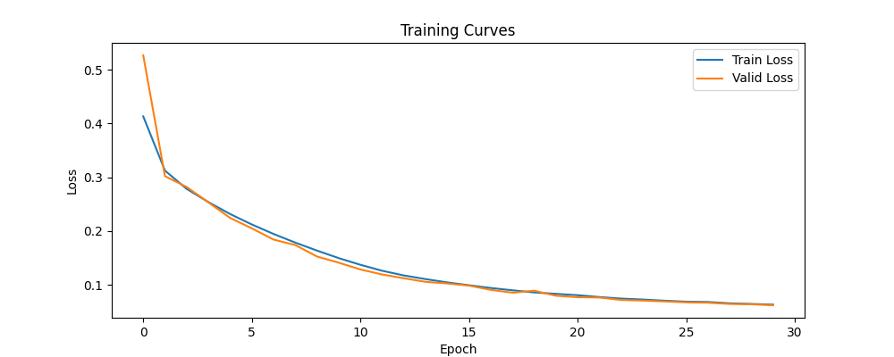
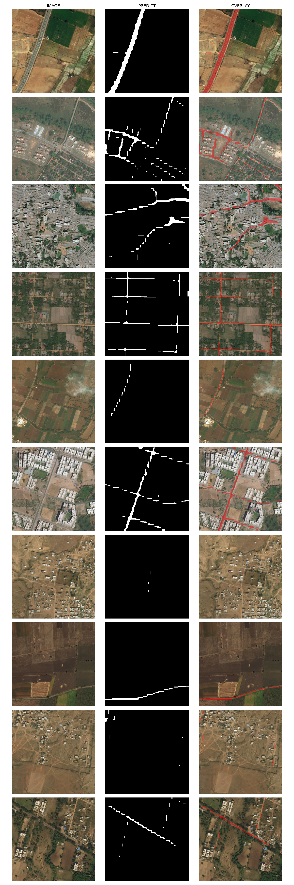

# Road Segmentation from Satellite Imagery

Semantic segmentation of roads in satellite images using PyTorch. Compares U-Net (from scratch) and DeepLabV3 (pretrained ResNet-50) against classical baselines on the [DeepGlobe Road Extraction dataset](https://www.kaggle.com/datasets/balraj98/deepglobe-road-extraction-dataset).

**Best result:** U-Net at 256×256 — **IoU 0.588**

---

## Results

| Model | Val IoU | Params | Notes |
|-------|---------|--------|-------|
| **U-Net 256×256** | **0.588** | 31.0M | Best overall |
| U-Net 512×512 | 0.565 | 31.0M | Sharper boundaries, stricter pixel matching |
| DeepLabV3 | 0.348 | 39.6M | Pretrained ResNet-50; struggles with thin roads |
| K-Means (k=2–6) | ~0.20–0.30 | — | Unsupervised baseline |
| RGB Thresholding | ~0.15–0.25 | — | Statistical baseline |

---

## Visual Results

### Dataset samples


### U-Net predictions (val set)


### U-Net training curves


### DeepLabV3 predictions (val set)


---

## Quick Start

```bash
git clone https://github.com/WillzWayn/road-semantic-segmentation.git
cd road-semantic-segmentation
uv sync

uv run python -m src --help   # explore the CLI
uv run pytest -q              # run the test suite
```

> Training and inference require the DeepGlobe dataset. See [Data Setup](#data-setup).

---

## Stack

Python 3.12 · PyTorch · Torchvision · Typer · NumPy · scikit-learn · Matplotlib · Pillow · Pytest · Modal (optional GPU training)

---

## Architecture

### U-Net

Classic encoder-decoder with skip connections, built from scratch.

```
Input (3×256×256)
    ↓
Encoder: 64 → 128 → 256 → 512 → 1024
    ↓                              ↓
    └──── skip connections ────────┘
Decoder: 1024 → 512 → 256 → 128 → 64
    ↓
Output (1×256×256 logits)
```

Key modules (`src/models/blocks.py`): `DoubleConv` (Conv→BN→ReLU×2), `Down` (MaxPool + DoubleConv), `Up` (ConvTranspose + skip concat + DoubleConv).

### DeepLabV3

Pretrained ResNet-50 backbone with Atrous Spatial Pyramid Pooling (ASPP). Dilated convolutions capture multi-scale context but underperform on thin, elongated structures like roads compared to U-Net's skip connections.

---

## Training Configuration

| Parameter | U-Net 256× | U-Net 512× | DeepLabV3 |
|-----------|-----------|-----------|-----------|
| Image size | 256×256 | 512×512 | 256×256 |
| Batch size | 8 | 4 | 8 |
| Learning rate | 1e-4 | 1e-4 | 1e-4 |
| Epochs | 30 | 30 | 30 |
| Optimizer | Adam | Adam | Adam |
| Scheduler | ReduceLROnPlateau | ReduceLROnPlateau | ReduceLROnPlateau |
| Loss | BCEWithLogitsLoss | BCEWithLogitsLoss | BCEWithLogitsLoss |

**Augmentation** (training only): horizontal/vertical flips, 90°/180°/270° rotations, affine transforms (±12° rotation, ±5% translation, 0.95–1.05× scale).

---

## Data Setup

```bash
# Option 1: automated (requires kaggle CLI)
uv run python scripts/dataset_downloader.py

# Option 2: manual
kaggle datasets download balraj98/deepglobe-road-extraction-dataset
unzip deepglobe-road-extraction-dataset.zip -d dataset/
```

Expected structure:
```
dataset/
├── train/   (<id>_sat.jpg + <id>_mask.png)
├── valid/   (<id>_sat.jpg)
└── test/    (<id>_sat.jpg)
```

---

## Usage

### CLI

```bash
# Train
uv run python -m src train unet
uv run python -m src train unet --epochs 10 --lr 0.001 --batch-size 4 --image-size 512
uv run python -m src train deeplabv3

# Predict
uv run python -m src predict unet
uv run python -m src predict unet --checkpoint outputs/checkpoints/best_unet.pth --threshold 0.40
uv run python -m src predict deeplabv3
```

### Baselines

```bash
uv run python src/baselines/data_exploration.py
uv run python src/baselines/kmeans.py
uv run python src/baselines/rgb_thresholding.py
```

### Cloud training (Modal GPU)

```bash
modal volume create unet-dataset && modal volume create unet-outputs
modal volume put unet-dataset dataset/train /train
modal volume put unet-dataset dataset/valid /valid
modal run --detach scripts/modal_unet_train.py
```

---

## Project Structure

```
src/
├── models/          # unet.py, deeplabv3.py, blocks.py
├── training/        # train_unet.py, train_deeplabv3.py, dataset.py
├── evaluation/      # local prediction scripts
├── baselines/       # kmeans.py, rgb_thresholding.py, data_exploration.py
├── losses/          # BCEWithLogitsLoss, BCEDiceLoss
├── transforms/      # image/mask augmentation pipeline
├── utils/           # metrics.py (IoU), visualization.py
└── cli.py           # Typer CLI entry point

scripts/             # Modal cloud training, dataset download, preview tools
tests/               # dataset, metrics, model, CLI coverage
report/              # LaTeX source and compiled PDFs
docs/images/         # curated visuals used in this README
```

---

## Report

Full academic report (IEEEtran, 5 pages) and presentation slides:

- [`report/output/report.pdf`](report/output/report.pdf)
- [`report/output/presentation.pdf`](report/output/presentation.pdf)

---

## License

MIT — see [LICENSE](LICENSE).

## Dataset

DeepGlobe Road Extraction Dataset (CC0 / Public Domain).  
Demir et al., *DeepGlobe 2018: A Challenge to Parse the Earth Through Satellite Images*, CVPR Workshops 2018.
